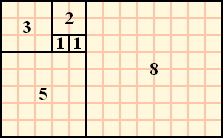

# 피보나치 수열(Fibonacci Sequence)

피보나치 수열이란?<br>

```
특정 위치의 숫자는 첫번째 바로 앞에 숫자와 두번째 앞의 숫자를 더한 것이 되는 수열을 의미한다.
```



## <재귀함수의 이용>

```python
import time

def recursive_fibonacci(n):
    if n < 2:
        return n
    else:
        return recursive_fibonacci(n-1) + recursive_fibonacci(n-2)

start_time = time.time()

print(recursive_fibonacci(50))

elapsed_time = time.time() - start_time

print("총 소요시간: {}초".format(elapsed_time))

```

위 코드는 피보나치 수열을 재귀적으로 짠 코드이다.<br>
50번째의 피보나치 수를 구하기 위해서 n에 50을 넣고 <br>
return 하는 곳에서 함수 인자가 각각 n=49, n=48이 들어가는<br>
함수를 호출합니다. ----> 엄청난 성능 저하


## 반복문의 이용

```python
import time

def iter_fibonacci(n):
    a, b = 1, 1
    if n < 2:
        return 1
    else:
        for i in range(n-2):
            c = a + b
            a, b = b, c
        return c   
  
start_time = time.time()

print(iter_fibonacci(50))

elapsed_time = time.time() - start_time

```

피보나치 수열을 또 다른 방식으로 구하기 위해 함수를 반복문으로 짠 코드이다.<br>
for 문이 하나이므로 즉, n의 크기에 따라 계산 속도가 선형적으로 비례한다.<br> ----> 속도 매우 빠름..성능 good

## 수식 이용

```python
import time

def equation_fibonacci(n):
    root_5 = 5 ** (1/2)
    return (1 / root_5) * ( ( (1 + root_5) / 2)**n - ( (1 - root_5) / 2)**n )

start_time = time.time()

print(equation_fibonacci(50))

elapsed_time = time.time() - start_time

print("총 소요시간: {}초".format(elapsed_time))

```

피보나치 수열 유도 공식을 이용해서 50번째의 피보나치 수를 구하는 코드입니다.<br>
이 방식도 반복문과 같이 속도가 빠르다.<br>
----> 성능 good!


# 탐구 결과

재귀함수, 반복문, 수식을 이용해서 n 번째 피보나치 수를 구해봤을 때 반복문의 성능이 제일 좋았다. 재귀 함수를 비교 대상에서 제외시키고
반복문과 수식만 비교해봤을 때 n의 값을 증가시키면서 탐구해 본 결과 반복문에서의 성능이 더 좋았다. 여기서 성능이 좋다라는 의미는 계산 속도가 빠르다는 것을 의미한다.


#include <Wire.h> 
#include <LiquidCrystal_I2C.h>
#include <DHT.h>
#define DHTPIN 7     // 디지털 7번핀 사용
#define DHTTYPE DHT11   // DHT 11 모델사용 (DHT21/22 사용 가능)
 
LiquidCrystal_I2C lcd(0x3F, 16, 2); //LCD 설정 (I2C주소는 LCD의 종류에 따라 다르기때문에 LCD가 0x3F, 0x20, 0x27인지 확인하세요)
DHT dht(DHTPIN, DHTTYPE);
 
void setup()
{
  lcd.init();
  Serial.begin(9600);
  dht.begin();
}
 
void loop() {
  float h = dht.readHumidity(); // 습도 측정
  float t = dht.readTemperature(); // 섭씨 온도 측정
   
  lcd.backlight();
  lcd.display();
  lcd.print("TEMP:     ");
  lcd.print(t);
  lcd.setCursor(0,1);
  lcd.print("HUMIDITY: ");
  lcd.print(h);
 
  Serial.print("습도: ");
  Serial.print(h);
  Serial.print(" 온도: ");
  Serial.print(t);
  Serial.println();
  delay(2000); //10초마다 Refresh
  lcd.clear();
}
